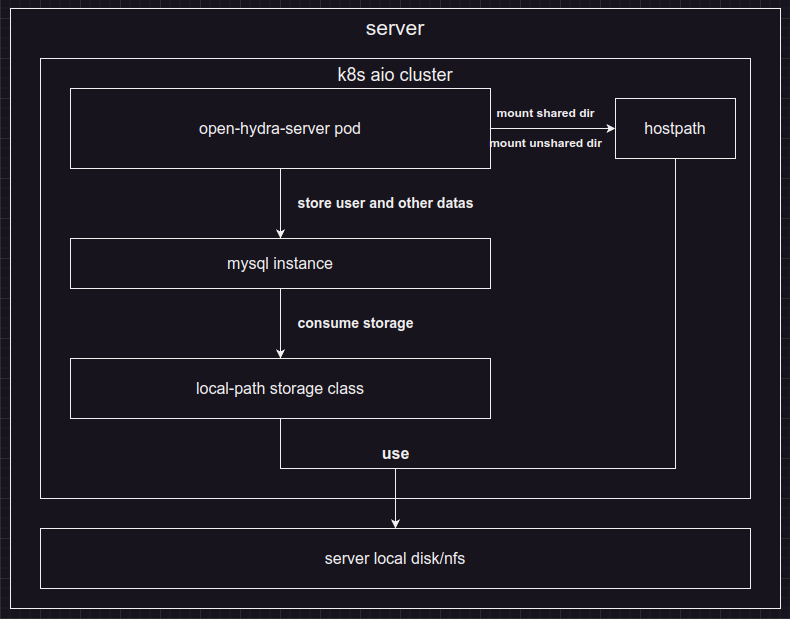
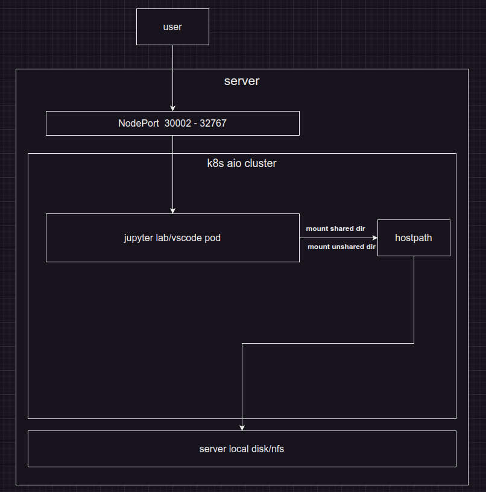
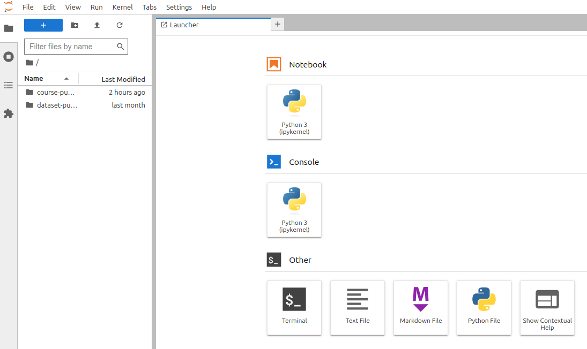
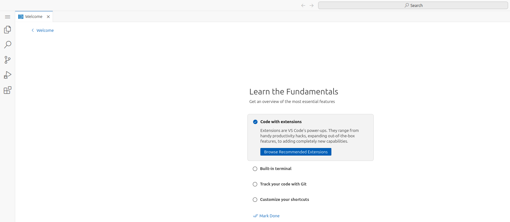
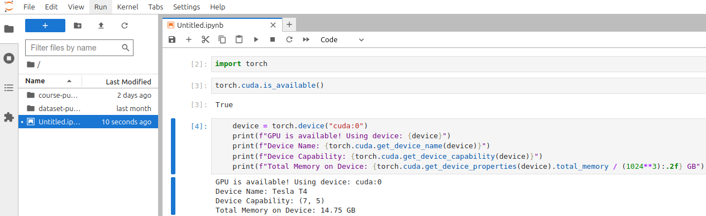

# open-hydra

open-hydra is a management platform dedicated to `machine learning|deep learning` education and training all-in-one machine, which can be used to quickly create/delete online development environments. It's has following features:

* It's cloud native, and can be deployed on kubernetes.
  * use api aggregation to extend kubernetes api server
* It has pre-built aio iso image including
  * all required container images
  * kubernetes aio cluster with version 1.23.17
  * open-hydra server with version 0.1.0
    * nginx reverse proxy
  * open-hydra ui with version 0.1.0
  * mysql operator with version 1.0.0
    * community-operator:8.2.0-2.1.1
    * community-server:8.2.0
  * nvidia gpu operator with driver version 525.125.06
    * time slicing share is enabled by default for nvidia gpu -> 1*4
  * `Note we lack of english version of ui for now we suggest to translate the entire ui to english use google translate or other tools`

## Open-hydra management component architecture



## Open-hydra user component architecture



## Compile from source code

```bash
# output to cmd/open-hydra-server
$ make go-build
```

## Quick Start

* We will run open-hydra in docker
* Install [kind](https://kind.sigs.k8s.io/docs/user/quick-start) before we start
  * note kind support many container runtime, if you choose other container runtime free feel to use it and change command to suit your container runtime
* Docker is required and in up and running stat
* cpu >= 4
* free memory >= 8G
* free disk >= 60G

```bash
# Create k8s cluster with kind
$ kind create cluster
# output
Creating cluster "kind" ...
 ✓ Ensuring node image (kindest/node:v1.29.2) 🖼 
 ✓ Preparing nodes 📦  
 ✓ Writing configuration 📜 
 ✓ Starting control-plane 🕹️ 
 ✓ Installing CNI 🔌 
 ✓ Installing StorageClass 💾 
Set kubectl context to "kind-kind"
You can now use your cluster with:

kubectl cluster-info --context kind-kind

Have a nice day! 👋

# Check the container status
$ docker ps | grep -i kindest
74f2c42b481e   kindest/node:v1.29.2   "/usr/local/bin/entr…"   2 minutes ago   Up 2 minutes   127.0.0.1:42199->6443/tcp   kind-control-plane

# enter container bash
$ docker exec -it 74f2c42b481e /bin/bash

# install git
root@kind-control-plane:/# cd && apt update && apt install -y git

# download open-hydra project
root@kind-control-plane:# git clone https://github.com/openhydra/open-hydra.git

# deploy mysql-operator
root@kind-control-plane:# cd open-hydra
root@kind-control-plane:# kubectl apply -f deploy/mysql-operator-crds.yaml
root@kind-control-plane:# kubectl apply -f deploy/mysql-operator.yaml
# wait a few minutes for mysql-operator to be ready
root@kind-control-plane:# kubectl get pods -n mysql-operator
NAME                              READY   STATUS    RESTARTS   AGE
mysql-operator-754799c79b-r4gv8   1/1     Running   0          99s
# deploy mysql instance
root@kind-control-plane:# kubectl apply -f deploy/mysql-instance.yaml
# wait a few minutes for mysql to be ready
root@kind-control-plane:# kubectl get pods -n mysql-operator
# output
# we should see mycluster-0 and mycluster-router-xxxx appears
NAME                                READY   STATUS    RESTARTS   AGE
mycluster-0                         2/2     Running   0          4m6s
mycluster-router-5c6646bfd5-r5q5q   1/1     Running   0          43s

# deploy open-hydra-server 
# create some directories for open-hydra-server
root@kind-control-plane:# mkdir /mnt/public-dataset
root@kind-control-plane:# mkdir /mnt/public-course
root@kind-control-plane:# mkdir /mnt/jupyter-lab
root@kind-control-plane:# mkdir /mnt/public-vscode
# create open-hydra namespace
root@kind-control-plane:# kubectl create ns open-hydra
# replace localhost with your container ip
root@kind-control-plane:# ip=$(ip a show dev eth0 | grep -w inet | awk '{print $2}' | cut -d "/" -f 1)
root@kind-control-plane:# sed -i "s/localhost/$ip/g" deploy/install-open-hydra.yaml
# create open-hydra deployment
root@kind-control-plane:# kubectl apply -f deploy/install-open-hydra.yaml
# check it out
root@kind-control-plane:# kubectl get pods -n open-hydra
# output
NAME                                 READY   STATUS    RESTARTS   AGE
open-hydra-server-5fcdff6645-94h46   1/1     Running   0          109s

# create an admin account
root@kind-control-plane:# kubectl create -f deploy/user-admin.yaml
# view user
root@kind-control-plane:# kubectl get openhydrausers -o yaml
# output
apiVersion: v1
items:
- apiVersion: open-hydra-server.openhydra.io/v1
  kind: OpenHydraUser
  metadata:
    creationTimestamp: null
    name: admin
  spec:
    chineseName: admin
    description: admin
    password: openhydra
    role: 1
  status: {}
kind: List
metadata:
  resourceVersion: ""

# Due to the large size of lab image you probably want to download it before we run it
root@kind-control-plane:# ctr -n k8s.io i pull docker.io/99cloud/jupyter:Python-3.8.18-dual-lan
# ensure image is proper downloaded and loaded into containerd
docker.io/99cloud/jupyter:Python-3.8.18-dual-lan:                                 resolved       |++++++++++++++++++++++++++++++++++++++| 
manifest-sha256:5c4fa3b3103bdbc1feacdd0ed0880be4b3ddd8913e46d3b7ade3e7b0f1d5ebd1: done           |++++++++++++++++++++++++++++++++++++++| 
config-sha256:999c96811ac8bac0a4d41c67bb628dc01b4e529794133a791b953f11fc7f4039:   done           |++++++++++++++++++++++++++++++++++++++| 
layer-sha256:82c434eb639ddb964f5089c4489d84ab87f6e6773766a5db3e90ba4576aa1fcd:    done           |++++++++++++++++++++++++++++++++++++++| 
layer-sha256:827606935cb54e3918e80f62abe94946b2b42b7dba0da6d6451c4a040fa8d873:    done           |++++++++++++++++++++++++++++++++++++++| 
layer-sha256:4f4fb700ef54461cfa02571ae0db9a0dc1e0cdb5577484a6d75e68dc38e8acc1:    done           |++++++++++++++++++++++++++++++++++++++| 
layer-sha256:3dd181f9be599de628e1bc6d868d517125e07f968824bcf7b7ed8d28ad1026b1:    done           |++++++++++++++++++++++++++++++++++++++| 
elapsed: 638.3s                                                                   total:  60.4 M (96.8 KiB/s) 

# deploy dashboard
root@kind-control-plane:# kubectl apply -f deploy/reverse-proxy.yaml
# check the result
root@kind-control-plane:# kubectl get deploy,svc,ep -n open-hydra reverse-proxy
# output
NAME                            READY   UP-TO-DATE   AVAILABLE   AGE
deployment.apps/reverse-proxy   1/1     1            1           95s

NAME                    TYPE        CLUSTER-IP      EXTERNAL-IP   PORT(S)   AGE
service/reverse-proxy   ClusterIP   10.96.146.137   <none>        80/TCP    95s

NAME                      ENDPOINTS        AGE
endpoints/reverse-proxy   10.244.0.12:80   95s

# Download the dashboard project
root@kind-control-plane:# cd && git clone https://github.com/openhydra/open-hydra-ui.git
root@kind-control-plane:# cd open-hydra-ui
root@kind-control-plane:# proxy=$(kubectl get svc reverse-proxy -o jsonpath='{.spec.clusterIP}' -n open-hydra)
root@kind-control-plane:# sed -i "s/{address}/${proxy}/g" deploy/nginx.conf
root@kind-control-plane:# kubectl create cm open-hydra-ui-config --from-file deploy/nginx.conf -n open-hydra
root@kind-control-plane:# kubectl apply -f deploy/deploy.yaml

# All set, check container's ip before we quit container bash
root@kind-control-plane:# echo $ip
# output
172.18.0.2
# exit the container
root@kind-control-plane:# exit

# Access dashboard 
# Open your browser and visit http://172.18.0.2:30001
# login with admin/openhydra
```

## Deploy openhydra

### Use pre-built aio iso image

Please refer to [iso installation guide](iso-installation-guide-en.md)

### Deploy open-hydra on existing k8s environment

#### Before you start

* The k8s version tested is 1.23.17. Theoretically it should work on 1.23.17+ versions. If you don't have k8s, you can quickly create one using kubeadm, refer to [kubeadm](https://kubernetes.io/docs/setup/production-environment/tools/kubeadm/create-cluster-kubeadm/)
* If you don't have a gpu, it won't stop you from building the environment, you just can't create an environment with a gpu. If you create an environment with a gpu device, the pod will enter the pending state
* Correctly configure the gpu device name, the cuda version pre-installed in jupyter lab is aligned with the nvidia driver `525.125.06` and `535.129.03` is tested to be worked

```bash
# Confirm the name of your gpu device in k8s
$ kubectl describe node
# Assuming the name of your gpu device is nvidia/tesla-v100
# Modify the config map file
# Find the content under config.yaml: | and modify the key defaultGpuDriver to nvidia/tesla-v100
$ vi open-hydra-server/deploy/install-open-hydra.yaml
```

* Confirm that the storage class is set to default. The storage class will be used by the mysql-operator, so we need a default sc. If you don't have a sc, you can quickly use `rancher.io/local-path` to simulate a local directory

```bash
# set the storage class to default
$ kubectl patch storageclass {you storage class name} -p '{"metadata": {"annotations":{"storageclass.kubernetes.io/is-default-class":"true"}}}'
```

* Create a shared directory for courses and code with will be mounted to pod of development environment

```bash
# Create a directory to store courses and code
# public-dataset is used to store public datasets
$ mkdir /mnt/public-dataset
# public-course is used to store your courses
$ mkdir /mnt/public-course
# jupyter-lab is used to store user jupyter lab code
$ mkdir /mnt/jupyter-lab
# public-vscode is used to store user vscode code
$ mkdir /mnt/public-vscode

# In case you do not use these path ,you can simply change it in install-open-hydra.yaml with following key
# datasetBasePath
# jupyterLabHostBaseDir
# vscodeBasePath
# courseBasePath
```

#### Deploy open-hydra on existing k8s cluster

```bash
# create a mysql database
$ kubectl apply -f deploy/mysql-operator-crds.yaml
$ kubectl apply -f deploy/mysql-operator.yaml
$ kubectl apply -f deploy/mysql-instance.yaml

# wait a few minutes for mysql to be ready
$ kubectl get pods -n mysql-operator
# output
NAME                                READY   STATUS    RESTARTS   AGE
mycluster-0                         2/2     Running   0          2m
mycluster-router-5d74f97d5b-plpp5   1/1     Running   0          1m
mysql-operator-66bfb7f6df-82zcn     1/1     Running   0          5m

# deploy open-hydra
$ kubectl apply -f deploy/install-open-hydra.yaml
# wait a few minutes for open-hydra to be ready
$ kubectl get pods -n open-hydra
# output
$ NAME                                    READY   STATUS    RESTARTS   AGE
open-hydra-server-5c659bf678-n5ldl      1/1     Running   0          60m
# check apiservice 
$ kubectl get apiservice v1.open-hydra-server.openhydra.io
# output
NAME                                SERVICE                        AVAILABLE   AGE
v1.open-hydra-server.openhydra.io   open-hydra/open-hydra-server   True        61m
```

### Use open-hydra

#### Create admin user(optional, skip it if you use iso installation or do not need dashboard)

* Note you won't be able to create admin user and other related resources using kubectl if you set `disableAuth: true` when you deploy open-hydra

```bash
# create admin user
$ kubectl create -f deploy/user-admin.yaml
# check user admin created
$ kubectl get openhydrausers
# output
NAME    AGE
admin   <unknown>
```

#### Deploy `open-hydra-ui`(optional, skip it if you use iso installation or do not need dashboard)

* Please note `open-hydra-ui` does not have a backend, only html pages and js scripts, so we will start a reverse proxy to proxy the apiserver, which has some security risks, it is not recommended to deploy `open-hydra-ui` in a high security environment, you can implement a backend page yourself, please refer to [api document](docs/api.md)

```bash
# create reverse proxy
$ kubectl apply -f deploy/reverse-proxy.yaml
# check reverse proxy
$ kubectl get ep,svc -n open-hydra reverse-proxy
# output
NAME                      ENDPOINTS          AGE
endpoints/reverse-proxy   172.25.27.254:80   94m

NAME                    TYPE        CLUSTER-IP     EXTERNAL-IP   PORT(S)   AGE
service/reverse-proxy   ClusterIP   10.96.66.183   <none>        80/TCP    94m

# download open-hydra-ui project
$ cd open-hydra-ui/deploy
# modify nginx.conf replace {address} with reverse-proxy service cluster ip
$ proxy=$(kubectl get svc reverse-proxy -o jsonpath='{.spec.clusterIP}' -n open-hydra)
$ sed -i "s/{address}/${proxy}/g" nginx.conf
# create ui config
$ kubectl create cm open-hydra-ui-config --from-file nginx.conf -n open-hydra
# create ui deployment and svc
$ kubectl create -f deploy.yaml
# check ui deployment and svc
$ kubectl get svc,ep -n open-hydra open-hydra-ui
# output
NAME                    TYPE       CLUSTER-IP     EXTERNAL-IP   PORT(S)        AGE
service/open-hydra-ui   NodePort   10.111.179.4   <none>        80:30001/TCP   111m

NAME                      ENDPOINTS          AGE
endpoints/open-hydra-ui   172.25.27.255:80   111m

# now you should be able to access http://[ip]:30001 with web browser
```

#### Enable nvidia gpu time slicing share(optional)

```bash
# create time slicing instance of gpu-operator
# you can modify replicas setting in deploy/time-slicing-gpu.yaml before you create it
$ kubectl apply -f deploy/time-slicing-gpu.yaml
# patch gpu-operator
$ kubectl patch clusterpolicy/cluster-policy     -n gpu-operator --type merge     -p '{"spec": {"devicePlugin": {"config": {"name": "time-slicing-config-all", "default": "any"}}}}'
# wait a few minutes for gpu-operator to be recreated
$ kubectl get pod -n gpu-operator -w

```

#### Create a user

```bash
# role 1 = admin
# role 2 = user
$ cat <<EOF > user1.yaml
apiVersion: open-hydra-server.openhydra.io/v1
kind: OpenHydraUser
metadata:
  name: user1
spec:
  password: password
  role: 2
EOF

# create it
$ kubectl create -f user1.yaml
# check it
$ kubectl get openhydrausers user1
# output
NAME    AGE
user1   <unknown>
```

#### Create a jupyter lab for user1

```bash
$ cat <<EOF > user1-device.yaml
apiVersion: open-hydra-server.openhydra.io/v1
kind: Device
metadata:
  name: user1
spec:
  openHydraUsername: user1
EOF

# create it
$ kubectl create -f user1-device.yaml
# check result
$ kubectl get devices user1 -o custom-columns=User:.spec.openHydraUsername,LabUrl:.spec.jupyterLabUrl,Status:.spec.deviceStatus
# output
User    LabUrl                       Status
user1   http://172.16.151.70:31001   Running
# 用浏览器打开页面 http://172.16.151.70:31001
```



#### Shutdown the jupyter lab for user1

* Note only 1 device either jupyter lab or vscode can be created for a user at the same time
* Even we delete pod but user data will be remained

```bash
# delete it
$ kubectl delete -f user1-device.yaml
# check the result
# give it 30 seconds to delete the pod
$ kubectl get devices user1 -o custom-columns=User:.spec.openHydraUsername,LabUrl:.spec.jupyterLabUrl,Status:.spec.deviceStatus
# 输出
User    LabUrl   Status
user1   <none>   Terminating
```

#### Create a vscode for user1

```bash
$ cat <<EOF > user1-device-vscode.yaml
apiVersion: open-hydra-server.openhydra.io/v1
kind: Device
metadata:
  name: user1
spec:
  ideType: vscode
  openHydraUsername: user1
EOF

# create it
$ kubectl create -f user1-device-vscode.yaml
# check result
$ kubectl get devices user1 -o custom-columns=User:.spec.openHydraUsername,LabUrl:.spec.vsCodeUrl,Status:.spec.deviceStatus
# output
User    LabUrl                       Status
user1   http://172.16.151.70:30013   Running
```



### Create a gpu device for user1 with jupyter lab

```bash
# delete vscode pod
$ kubectl delete -f user1-device-vscode.yaml

# create a config
$ cat <<EOF > user1-gpu-device.yaml
apiVersion: open-hydra-server.openhydra.io/v1
kind: Device
metadata:
  name: user1
spec:
  openHydraUsername: user1
  deviceGpu: 1
EOF

# create it
$ kubectl create -f user1-gpu-device.yaml

# check result
kubectl get devices user1 -o custom-columns=User:.spec.openHydraUsername,LabUrl:.spec.jupyterLabUrl,Status:.spec.deviceStatus,GPU:.spec.deviceGpu
# output
User    LabUrl                       Status    GPU
user1   http://172.16.151.70:37811   Running   1

# open browser and enter http://172.16.151.70:37811
```



## trouble shooting

Please see [trouble shooting](trouble-shooting-en.md) for detail
